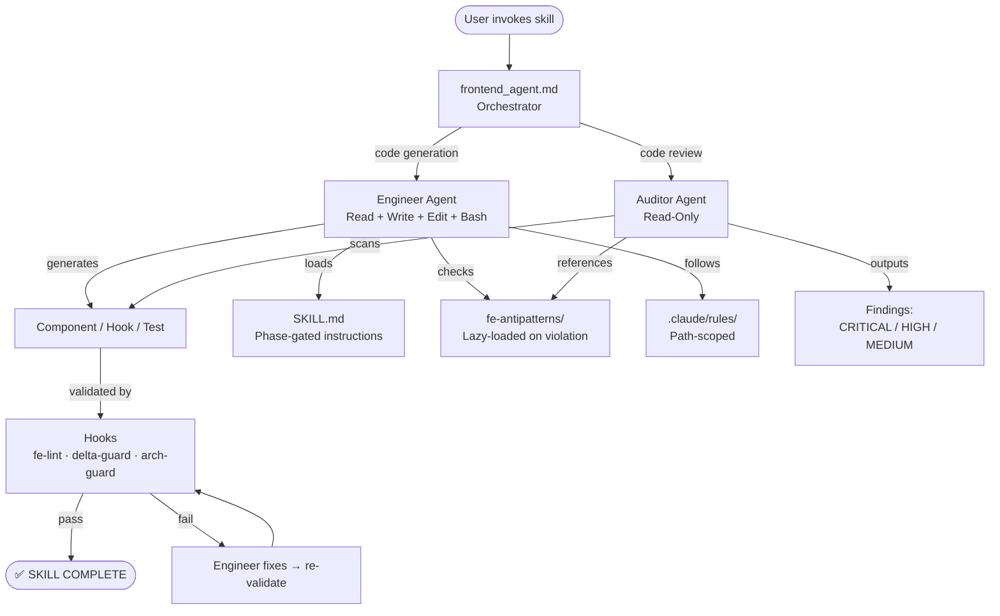

# AI Setup Inventory

Full catalog of all AI context files in this repository.

## Core Files

| File | Purpose |
|------|---------|
| `CLAUDE.md` | Project context: tech stack, commands, safety, skill list (SSOT) |
| `AGENTS.md` | Agent registry: skill routing for Codex/OpenAI agents |
| `.mcp.json` | MCP server configuration (10 servers: context7, sequential-thinking, github, playwright, figma, openapi, task-master-ai, shadcn, nextjs, agentation) |

## Agents

| File | Role | Skills |
|------|------|--------|
| `.claude/frontend_agent.md` | Frontend Lead (Orchestrator) | Routing + architect skills |
| `.claude/agents/engineer.md` | Code Generator | component-gen, component-gen-next, api-bind, component-tests, e2e-tests, refactor |
| `.claude/agents/auditor.md` | Quality Gatekeeper | code audit |

<details>
<summary><strong>Agent flow diagram</strong></summary>



</details>

## Skills (`.claude/skills/`)

| Skill | Priority | Framework | Output |
|-------|----------|-----------|--------|
| `component-gen/` | P0 | react\|vue | FSD dirs + `.tsx` or `.vue` with 4 states (SPA only) |
| `component-gen-next/` | P0 | next | RSC + `.loading.tsx` + `actions.ts` + Suspense boundaries |
| `component-tests/` | P0 | react\|vue | Vitest + Testing Library tests + a11y audit |
| `api-bind/` | P1 | react\|vue | Types + client + TanStack Query hook (OpenAPI or Proto) |
| `api-mocks/` | P1 | agnostic | MSW v2 handlers + typed fixtures (OpenAPI, api-bind, or manual) |
| `e2e-tests/` | P2 | agnostic | Playwright test file |
| `browser-check/` | P2 | agnostic | AI self-verification report (chat-only, no file artifacts) |
| `fe-repo-scout/` | P3 | agnostic | Recon report |
| `be-repo-scout/` | P1 | agnostic | Backend API contracts + TS interfaces + Zod schemas |
| `init-project/` | P3 | agnostic | Project CLAUDE.md |
| `pr/` | P3 | agnostic | Pull request |
| `init-agent/` | P3 | agnostic | Frontend agent job description (frontend_agent.md) |
| `update-ai-setup/` | P3 | agnostic | Sync docs/ai-setup.md Registry |
| `fix-markdown/` | P3 | agnostic | Fix markdownlint errors in .md files |
| `init-skill/` | P3 | agnostic | Create or improve a skill interactively |
| `skill-audit/` | P3 | agnostic | Audit SKILL.md for bloat and anti-patterns |
| `agents-checker/` | P3 | agnostic | Verify .claude/agents/ structural integrity |
| `spec-audit/` | P3 | agnostic | Deep QA audit of a UI/UX specification |
| `setup-configs/` | P3 | react\|vue | Vite + TS project config boilerplate |
| `curate-lessons/` | P3 | agnostic | Deduplicate + graduate .ai-lessons/ into context files |
| `react-doctor/` | P2 | react | React Doctor health check (0-100 score + diagnostics) |
| `vue-doctor/` | P2 | vue | Vue Doctor health check (0-100 score, Oxlint + eslint-vue + vue-tsc) |
| `web-vitals/` | P2 | agnostic | Core Web Vitals + performance budget audit |
| `frontend-code-review/` | P1 | agnostic | Review PR/diff: security, architecture, anti-patterns |
| `refactor/` | P1 | react\|vue | Code transforms: class-to-hooks, options-to-composition, cjs-to-esm, tanstack-v4-to-v5, custom |
| `ui-tweak/` | P2 | react-favored | Targeted code fixes from Agentation visual annotations |

Total: 25 skills

## Skill Flags Reference

### `/component-gen [react|vue] ComponentName`

| Flag | Description | Effect |
|------|-------------|--------|
| `--type feature` | Smart/async component (default) | All 4 states (loading, error, empty, success) + TanStack Query + Optimistic UI for mutations |
| `--type ui` | Presentational component | Props-driven only, no async. Output path: UI layer |
| `--design` | Activate Design Thinking | Scans palette tokens, enforces named aesthetic direction, motion budget, spatial composition |
| `--quick` | Fast single-file mode | Implies `--type ui`. 1 file (no types.ts, no index.ts), 5 quality gates instead of 30+. Incompatible with `--design` and `--type feature` |
| `--path <dir>` | Custom output directory | Override architecture-based path resolution. Example: `--path src/components/ui` |
| `--into <file>` | Inject markup into existing file | No new files created. Reads file → inserts JSX/template. For layout/markup tasks |

**Combinations:**

```text
/component-gen react Button --type ui               ← presentational, full quality gates
/component-gen vue Badge --quick                     ← fast single-file, minimal gates
/component-gen react HeroSection --type ui --design  ← presentational + design thinking
/component-gen react UserCard                        ← smart component, 4 states (default)
/component-gen vue --into src/pages/Home.vue "pricing section with 3 tiers"
/component-gen react Button --type ui --path src/components/ui
```

<details>
<summary><strong>Which flags should I use? (decision guide)</strong></summary>

```text
What are you building?
├─ Simple UI element (Button, Badge)?    → --quick
├─ Presentational component (Card)?
│  ├─ Needs polished design?             → --type ui --design
│  └─ Standard styling?                  → --type ui
├─ Data-fetching feature (UserList)?     → (default, no flags)
├─ Adding to existing file?              → --into path/File.tsx "desc"
└─ Next.js App Router?                   → /component-gen-next
```

</details>

### `/component-gen-next ComponentName`

Same flags as `/component-gen` but for Next.js App Router. Framework is always React.
Additional behavior: RSC by default, `'use client'` only when needed, Server Actions for mutations.

### `/component-tests [react|vue] [target]`

| Flag                      | Description                                |
|---------------------------|--------------------------------------------|
| `ComponentName`           | Test a component by name (auto-finds file) |
| `path/to/Component.tsx`   | Test a specific file                       |
| `src/features/*/ui/*.tsx` | Test by glob pattern                       |

Auto-detects `--type` from component imports. Pass `--type ui` or `--type feature` explicitly to override.

### `/api-bind [react|vue] <spec> <method|rpc> <endpoint>`

```text
/api-bind react ./openapi.json GET /api/users           ← OpenAPI
/api-bind vue ./proto/user.proto UserService.GetUser     ← Protobuf
/api-bind react                                          ← reads be-repo-scout §7 if no spec
```

Output: `{feature}Types.ts` + `{feature}Api.ts` + `use{Feature}.ts` (TanStack Query hook)

### `/fe-repo-scout [path?]`

```text
/fe-repo-scout               ← scan current directory
/fe-repo-scout ../other-app  ← scan another project
```

### `/be-repo-scout [path?]`

```text
/be-repo-scout                     ← scan current directory
/be-repo-scout ../backend-service  ← scan another project
```

### `/browser-check [url?] [flow?]`

```text
/browser-check                                               ← snapshot localhost:5173
/browser-check http://localhost:3000                         ← snapshot custom URL
/browser-check http://localhost:3000 "click Login, fill email, submit"  ← interaction flow
```

### `/react-doctor [mode] [options]`

```text
/react-doctor                    ← full health scan (default)
/react-doctor diff               ← diff-only scan against origin/main
/react-doctor diff develop       ← diff-only scan against develop branch
/react-doctor fix                ← auto-fix safe issues
/react-doctor --threshold 80     ← fail if score < 80
```

### `/vue-doctor [mode] [options]`

```text
/vue-doctor                      ← full health scan (default)
/vue-doctor diff                 ← diff-only scan against origin/main
/vue-doctor diff develop         ← diff-only scan against develop branch
/vue-doctor fix                  ← auto-fix safe issues (oxlint + eslint only)
/vue-doctor --threshold 80       ← fail if score < 80
```

### `/frontend-code-review`

```text
/frontend-code-review           ← review current branch diff vs main
/frontend-code-review --staged  ← review only staged changes
```

### `/refactor [react|vue] <transform>`

| Transform                | Description                              |
|--------------------------|------------------------------------------|
| `class-to-hooks`         | Class → functional + hooks (React only)  |
| `options-to-composition` | Options API → Composition API (Vue only) |
| `cjs-to-esm`             | require() → import                       |
| `tanstack-v4-to-v5`      | TanStack Query v4 → v5                   |
| `custom "<desc>"`        | AI-powered custom transform              |

| Flag             | Description                                    |
|------------------|------------------------------------------------|
| `--scope <glob>` | Limit files (default: `src/**/*.{tsx,vue,ts}`) |
| `--dry-run`      | Show plan without applying changes             |

### `/spec-audit <spec-file>`

```text
/spec-audit docs/user-profile-spec.md
```

## Skill Details

### `/component-gen` — variant behavior

| Variant                            | What it produces                                                                       | Key behavior                                                                                                                                                                                            |
|------------------------------------|----------------------------------------------------------------------------------------|---------------------------------------------------------------------------------------------------------------------------------------------------------------------------------------------------------|
| `ComponentName` (default)          | 3+ files: component + types + barrel (`index.ts`) + FSD dirs (`ui/`, `model/`, `api/`) | All 4 async states (loading skeleton, error with retry, empty, success). Optimistic UI for mutations. 30+ quality gates. Integration patterns auto-evaluated (share, calendar, mailto).                 |
| `--design`                         | Same file structure as default                                                         | Adds Design Thinking phase: scans Tailwind/CSS tokens, answers Purpose/Tone/Constraints/Differentiation. Enforces named aesthetic direction, motion budget (1 entrance animation), spatial composition. |
| `--quick`                          | 1 file only (no `types.ts`, no `index.ts`)                                             | Implies `--type ui`. Props interface inlined. Only 5 quality gates (no tsc, no lint, no gardener). For simple elements: Badge, Divider, Tag.                                                            |
| `--into <file> "description/task"` | 0 new files — edits existing file in-place                                             | Reads target file, matches existing Tailwind patterns and imports, injects JSX/template at correct location. For layout tasks: add a section to a page.                                                 |

**Auto-detection features:**

- **Architecture resolution:** `--path` > scout report > `CLAUDE.md` > auto-detect > FSD fallback
- **Page-level components** (name ends with Page/View/Route/Screen) auto-activate SEO protocol
- **Streaming keywords** in description → streaming patterns auto-loaded
- **Convention mismatch** warning if request contradicts `.claude/conventions/`

### `/component-tests` — testing details

- **Runner auto-detection:** Checks `vitest.config.*` / `jest.config.*` / `package.json` devDependencies. Falls back to Vitest if neither found.
- **Testing Library:** Uses `@testing-library/react` or `@testing-library/vue` — tests user-visible behavior (roles, labels, text), not implementation details.
- **A11y pre-audit:** Scans component ARIA roles before writing tests — extracted roles become `getByRole` selectors.
- **Feature components:** Tests all 4 async states (loading, error, empty, success).
- **UI components:** Tests prop variants, interactions, callbacks. No hallucinated async states.

### `/e2e-tests` — Playwright details

- **Page Object Model:** Every page gets a class extending `BasePage` with `waitForReady()` and `checkA11y()` (via `@axe-core/playwright`).
- **Auth:** `--auth` flag generates `storageState` setup — avoids re-login per test.
- **Network mocking:** `--mock` flag stubs unstable APIs with `page.route()`.
- **Visual regression:** `--visual` flag adds `toHaveScreenshot()` assertions.
- **Selectors:** Strict hierarchy — `getByRole` → `getByLabel` → `getByTestId` → CSS (last resort with comment).

### `/browser-check` — how it works

1. Opens URL in headless Chromium via `agent-browser` CLI (from [Vercel Labs](https://github.com/vercel-labs/agent-browser))
2. Takes DOM snapshot showing only interactive elements (`@e1`, `@e2`...) — 93% fewer tokens vs raw DOM
3. If flow description provided: translates to sequential commands (click, fill, assert)
4. Reports PASS/FAIL to chat — no files written, no test artifacts
5. Dev server must be running before invoking

### `/web-vitals` — performance thresholds

| Metric    | Target       | What it checks                                                                           |
|-----------|--------------|------------------------------------------------------------------------------------------|
| LCP       | < 2.5s       | Hero images in CSS `background-image`, missing `preload`, render-blocking resources      |
| CLS       | < 0.1        | Images without dimensions, async content without skeletons, fonts without `font-display` |
| INP       | < 200ms      | `JSON.parse` in render path, missing debounce on inputs, `useLayoutEffect` misuse        |
| JS bundle | < 300KB gzip | `lodash` (use lodash-es), `moment` (use date-fns), `import * as` (kills tree-shaking)    |

### `/ui-tweak` — visual feedback loop

Requires [Agentation](https://github.com/nichochar/agentation) — a React component + MCP server for visual annotations:

1. Developer sees a UI issue → clicks on the element in browser → writes a comment
2. Agentation captures context: CSS, component tree (React) or DOM selectors (Vue), screenshot
3. `/ui-tweak` fetches annotations via MCP → greps source file → applies surgical edit → type check + lint → resolves annotation
4. **Watch mode:** `watch` keeps polling for new annotations up to 30 minutes
5. **React-favored:** Gets full component tree for precise file location. Vue gets DOM-only context (less precise).

### Testing pyramid

```text
Testing Pyramid:                         Adjacent QA skills:

  /browser-check ←── Visual sanity         /spec-audit ←── Pre-dev spec QA
       ▲                                   /react-doctor | /vue-doctor ←── Health check
  /e2e-tests ←───── E2E journeys           /frontend-code-review ←── PR diff review
       ▲                                   /web-vitals ←── Performance audit
  /component-tests ← Unit tests            /ui-tweak ←── Visual fix loop
```

| Skill                   | Layer        | Tool                                                              | Output                                | When to use                            |
|-------------------------|--------------|-------------------------------------------------------------------|---------------------------------------|----------------------------------------|
| `/component-tests`      | Unit         | Vitest or Jest + Testing Library                                  | `*.test.tsx` files                    | After `/component-gen`, per component  |
| `/e2e-tests`            | E2E          | Playwright (Chromium)                                             | `*.spec.ts` + Page Objects + fixtures | Critical user flows (login, checkout)  |
| `/browser-check`        | Visual       | [agent-browser](https://github.com/vercel-labs/agent-browser) CLI | Chat-only report (no files)           | Quick "does it render?" check          |
| `/web-vitals`           | Perf audit   | Static analysis + build output                                    | `audit/web-vitals-report_*.md`        | Before launch or after bundle changes  |
| `/ui-tweak`             | Visual fix   | [Agentation](https://github.com/nichochar/agentation) MCP         | Edited source files                   | Human points at UI bug → AI fixes code |
| `/spec-audit`           | Spec QA      | Static analysis of spec doc                                       | `audit/spec-audit-report_*.md`        | Before writing component code          |
| `/react-doctor`         | Health check | Oxlint (60+ rules) + dead code scan                               | Chat report (0-100 score)             | Pre-release quality gate (React)       |
| `/vue-doctor`           | Health check | Oxlint + eslint-plugin-vue + vue-tsc                              | Chat report (0-100 score)             | Pre-release quality gate (Vue)         |
| `/frontend-code-review` | Code review  | Git diff analysis                                                 | Chat report                           | PR review or local diff check          |

## Anti-Patterns (`.claude/fe-antipatterns/`)

### common/ (21)

`console-log-in-production` · `empty-catch-block` · `env-variable-misuse` · `fetch-without-abort` · `form-validation-missing` · `hardcoded-api-urls` · `heavy-imports` · `images-without-dimensions` · `inline-styles` · `magic-numbers` · `memory-leak-subscriptions` · `microfrontend-css-leak` · `microfrontend-shared-state` · `missing-error-boundary` · `missing-error-state` · `missing-loading-state` · `mixed-concerns` · `no-global-error-handler` · `prop-drilling` · `race-condition-stale-response` · `unvirtualized-large-list`

### react/ (14)

`concurrent-misuse` · `context-overuse` · `dead-code` · `direct-dom-mutation` · `key-as-index` · `missing-usecallback` · `react-compiler-violations` · `ssr-hydration-mismatch` · `state-in-render` · `suspense-waterfall` · `unnecessary-memoization` · `unnecessary-useeffect` · `useeffect-no-deps` · `usestate-object-mutation`

### vue/ (9)

`direct-pinia-mutation` · `missing-defineprops-types` · `options-api-in-new-code` · `provide-inject-typing` · `reactive-destructuring-loss` · `template-complexity` · `v-for-no-key` · `v-for-v-if-same-element` · `vapor-incompatible-patterns`

### state/ (5)

`god-store` · `optimistic-update-no-rollback` · `pinia-store-coupling` · `server-state-in-client-store` · `zustand-derived-in-store`

### a11y/ (3)

`div-as-button` · `missing-alt-text` · `missing-aria-labels`

### design/ (1)

`no-generic-ai-aesthetics`

### security/ (3)

`open-redirect` · `sensitive-data-in-storage` · `xss-raw-html`

### css/ (3)

`animation-layout-thrashing` · `missing-responsive-handling` · `z-index-wars`

### testing/ (2)

`snapshot-overuse` · `testing-implementation-details`

Total: 61 anti-patterns

## Lessons Store (`.ai-lessons/`)

| File | Purpose |
|------|---------|
| `.ai-lessons/pending.md` | Append-only staging for raw lessons from reflection |
| `.ai-lessons/graduated.md` | Archive of lessons promoted into context files by `/curate-lessons` |

## Protocols

| File | Purpose |
|------|---------|
| `.claude/protocols/gardener.md` | Continuous improvement protocol |
| `.claude/protocols/reflection.md` | Structured failure analysis (triggers on SKILL PARTIAL / LOOP_GUARD) |

## Hooks

| File | Trigger | Purpose |
|------|---------|---------|
| `.claude/hooks/skill-lint.sh` | PostToolUse Write\|Edit on SKILL.md | Validate: Gardener ref, SKILL COMPLETE block |
| `.claude/hooks/fe-lint.sh` | PostToolUse Write\|Edit | Frontend lint validation |
| `.claude/hooks/delta-guard.sh` | PostToolUse Write\|Edit (async) | Warn on full overwrite of governed context files |
| `.claude/hooks/arch-guard.sh` | PostToolUse Write\|Edit (async) | Architecture boundary validation |
| `.claude/hooks/pre-compact.sh` | PreCompact | Save state before auto-compaction |
| `.claude/hooks/subagent-stop.sh` | SubagentStop | Validate SKILL COMPLETE/PARTIAL output |
| `.claude/hooks/session-start.sh` | SessionStart | Session initialization |
| `.claude/hooks/user-prompt-submit.sh` | UserPromptSubmit | Pre-process user prompt |

Total: 8 hooks

## Plugins (`settings.json → enabledPlugins`)

| Plugin | Purpose |
|--------|---------|
| `github@claude-plugins-official` | GitHub operations |
| `playwright@claude-plugins-official` | Browser automation and E2E |
| `figma@claude-plugins-official` | Figma design token access |

Total: 3 plugins

## MCP Servers (`.mcp.json → mcpServers`)

| Server | Package | Purpose |
|--------|---------|---------|
| `context7` | `@upstash/context7-mcp` | Library documentation lookup |
| `sequential-thinking` | `@modelcontextprotocol/server-sequential-thinking` | Multi-step reasoning |
| `github` | `@modelcontextprotocol/server-github` | GitHub API access |
| `playwright` | `@modelcontextprotocol/server-playwright` | Browser automation |
| `figma` | `figma-mcp-server.js` | Figma design data |
| `openapi` | `@modelcontextprotocol/server-openapi` | OpenAPI spec access |
| `task-master-ai` | `task-master-ai` | Task planning and sprint management |
| `shadcn` | `shadcn@latest` | shadcn/ui component API lookup |
| `nextjs` | `@vercel/mcp-adapter-next` | Next.js devtools (routes, performance) |
| `agentation` | `agentation-mcp` | Visual annotation feedback (Agentation) |

Total: 10 MCP servers

## Convention Files (`.claude/conventions/`)

Short, topic-specific files capturing architectural decisions. Read by `/fe-repo-scout` (§7),
scaffolded by `/init-project` (Step 7). Fill in after project setup.

| File | Topic |
|------|-------|
| `_index.md` | Table of all convention files |
| `api-layer.md` | Env vars, base URLs, auth headers |
| `fonts-and-assets.md` | Font source, CDN, asset pipeline |
| `i18n.md` | Internationalization strategy and library |
| `icons.md` | Icon library: source, package, usage pattern |
| `monorepo.md` | Monorepo conventions (Turborepo, workspace protocol) |
| `routing.md` | Router setup, file-based vs config-based |
| `ui-library.md` | Component library: shadcn / Headless UI / custom |

Total: 8 convention files (template stubs — fill per project)

## IDE Compatibility Files

| File | IDE |
|------|-----|
| `.cursor/rules/00-project-context.mdc` | Cursor — always loaded |
| `.cursor/rules/01-component-gen.mdc` | Cursor — SPA component files |
| `.cursor/rules/01b-component-gen-next.mdc` | Cursor — Next.js component files |
| `.cursor/rules/02-component-tests.mdc` | Cursor — test files |
| `.cursor/rules/03-react-doctor.mdc` | Cursor — React Doctor health check |
| `.cursor/rules/03b-vue-doctor.mdc` | Cursor — Vue Doctor health check |
| `.cursor/rules/04-ui-tweak.mdc` | Cursor — Agentation visual annotation fixes |
| `.cursor/rules/05-refactor.mdc` | Cursor — Code transforms and migrations |
| `.cursor/rules/06-frontend-code-review.mdc` | Cursor — Frontend code review |
| `.cursor/rules/07-fe-repo-scout.mdc` | Cursor — Frontend repo exploration |
| `.cursor/rules/08-be-repo-scout.mdc` | Cursor — Backend repo exploration |
| `.cursor/rules/09-web-vitals.mdc` | Cursor — Web Vitals audit |
| `.cursor/rules/10-browser-check.mdc` | Cursor — Browser self-verification |
| `.cursor/rules/11-api-bind.mdc` | Cursor — API binding |
| `.cursor/rules/12-e2e-tests.mdc` | Cursor — E2E tests |
| `.github/copilot-instructions.md` | VS Code Copilot / IntelliJ Copilot |
| `.agents/skills/*/SKILL.md` | Codex / OpenAI agents (25 wrappers) |

## Examples

| File | Demonstrates |
|------|-------------|
| `examples/react/UserCard.tsx` | React component with all 4 states |
| `examples/react/UserCard.types.ts` | TypeScript types pattern |
| `examples/react/UserCard.test.tsx` | Vitest + Testing Library tests |
| `examples/react/LoginForm.tsx` | Form component with validation |
| `examples/react/LoginForm.types.ts` | Form types pattern |
| `examples/react/LoginForm.test.tsx` | Form component tests |
| `examples/react/LoginForm.msw.test.tsx` | MSW-based API mocking tests |
| `examples/react/ErrorBoundary.tsx` | Error Boundary pattern |
| `examples/react/DeferredSearch.tsx` | useDeferredValue search pattern |
| `examples/react/useAuthStore.ts` | Zustand auth store |
| `examples/react/api-bind/userTypes.ts` | API binding types |
| `examples/react/api-bind/userApi.ts` | API client |
| `examples/react/api-bind/useUser.ts` | TanStack Query hook |
| `examples/react/api-bind-proto/userTypes.ts` | Proto-based API types |
| `examples/react/api-bind-proto/userApi.ts` | Connect transport client |
| `examples/react/api-bind-proto/useUser.ts` | TanStack Query hook (proto) |
| `examples/react/streaming-feature/StreamingFeature.tsx` | Streaming/SSE component |
| `examples/react/streaming-feature/StreamingFeature.types.ts` | Streaming types |
| `examples/react/streaming-feature/StreamingFeature.test.tsx` | Streaming component tests |
| `examples/next/UserCard/page.tsx` | Next.js App Router page |
| `examples/next/UserCard/UserCard.tsx` | Next.js client component |
| `examples/next/UserCard/loading.tsx` | Next.js loading state |
| `examples/next/UserCard/error.tsx` | Next.js error boundary |
| `examples/next/UserCard/actions.ts` | Next.js Server Actions |
| `examples/vue/UserCard.vue` | Vue SFC with all 4 states |
| `examples/vue/UserCard.test.ts` | Vue component tests |
| `examples/vue/useAuthStore.ts` | Pinia auth store |
| `examples/e2e/user-card.spec.ts` | Playwright E2E test |

## Rules (`.claude/rules/`)

Path-scoped rule files loaded automatically by Claude Code based on file context.

| File | Scope |
|------|-------|
| `a11y.md` | Accessibility (WCAG 2.2) rules |
| `architecture-alternatives.md` | Layer-based and domain-based alternatives to FSD |
| `async-states.md` | Mandatory 4-state pattern for async components |
| `context-files.md` | Delta Update Protocol for governed context files |
| `fsd.md` | Feature-Sliced Design layer hierarchy and import rules |
| `git-safety.md` | Git safety protocols and forbidden commands |
| `markdown.md` | Markdown conventions (MD040, MD056) |
| `monorepo.md` | Monorepo rules (workspace protocol, circular deps) |
| `react.md` | React hooks rules, compiler readiness, composition |
| `testing.md` | Testing conventions (AAA, selectors, mocking, a11y) |
| `typescript.md` | TypeScript strict rules (no any, no ts-ignore) |
| `vue.md` | Vue Composition API rules, Vapor Mode readiness |

Total: 12 rule files

## Adaptive Context Evolution (ACE)

This template adopts concepts from the [ACE paper (arXiv:2510.04618)](https://arxiv.org/abs/2510.04618),
which proposes treating AI context as an evolving playbook with scoring, reflection, and incremental curation
instead of static instructions.

### Problem

Static context files (`CLAUDE.md`, anti-patterns, SKILL.md) accumulate rules but never learn from failures.
Lessons discovered during a session are ephemeral — they appear in chat output and are lost when the session ends.
Full rewrites of context files risk "context collapse" — losing carefully tuned nuances.

### Adopted Concepts

| ACE Concept | Implementation | Files |
|-------------|---------------|-------|
| **Delta Updates** | Context files evolve via surgical `Edit`, never full `Write` overwrites. A `delta-guard.sh` hook warns on violations. | `CLAUDE.md` § Delta Update Protocol, `.claude/hooks/delta-guard.sh` |
| **Rule Annotations** | Safety rules tagged with `<!-- critical -->`, `<!-- frequent -->`, `<!-- important -->` HTML comments. Anti-pattern tables include a `Freq` column (`high`/`med`/`low`). | `CLAUDE.md` § Safety, `.claude/fe-antipatterns/_index.md` |
| **Reflection (Reflector role)** | Structured failure analysis protocol triggers on `⚠️ SKILL PARTIAL` or `🛑 LOOP_GUARD_TRIGGERED`. Extracts root cause, formulates 1 rule, dedup-checks against existing context, appends to lessons store. | `.claude/protocols/reflection.md` |
| **Lesson Curation (Curator role)** | `/curate-lessons` skill reviews pending lessons, deduplicates against existing rules (keyword grep), and graduates unique lessons into target context files with user approval. | `.claude/skills/curate-lessons/SKILL.md` |

### Learning Loop

```text
Skill failure (PARTIAL / LOOP_GUARD)
  → Reflection Protocol (.claude/protocols/reflection.md)
    → Append rule to .ai-lessons/pending.md
      → Accumulate ≥ 3 lessons
        → /curate-lessons
          → Dedup against CLAUDE.md, fe-antipatterns/, SKILL.md
            → Graduate unique rules into target files (Delta Update)
              → Move to .ai-lessons/graduated.md
```

The Gardener Protocol (`.claude/protocols/gardener.md`) also feeds into `.ai-lessons/pending.md`
as a valid target for cross-cutting rules that don't fit a single skill or anti-pattern category.

### Skipped ACE Concepts (and why)

| Concept | Reason for skipping |
|---------|-------------------|
| Auto helpful/harmful counters | Needs persistent state across sessions — no DB dependency. Manual `Freq` column is the pragmatic substitute |
| Embedding dedup (cosine similarity) | Needs Python + vector store. Keyword-grep in `/curate-lessons` is sufficient for ~30 anti-patterns |
| Autonomous curation loops | Public template — auto-mutating context is risky. User-triggered `/curate-lessons` is safer |
| Playbook ID system (`[FE-001]`) | File-path referencing already serves as stable ID |

## Changelog

| Date | Change |
|------|--------|
| 2026-03-09 | Registry sync: anti-pattern total 35→61 (+26: +12 common, +3 react, +1 vue, +2 state, +3 security, +3 css, +2 testing); +4 hooks (pre-compact, subagent-stop, session-start, user-prompt-submit); +7 Cursor wrappers (06-12); +2 conventions (i18n, monorepo); +Rules section (12 files); +21 examples; hook total 4→8; Cursor total 8→15; convention total 6→8; example total 4→25 |
| 2026-03-08 | +3 skills (web-vitals, frontend-code-review, refactor); +3 anti-patterns (react-compiler-violations, unnecessary-memoization, vapor-incompatible-patterns); +1 hook (arch-guard.sh); +1 Cursor wrapper (05-refactor.mdc); skill total 22→25; anti-pattern total 32→35 |
| 2026-03-08 | +1 skill (ui-tweak: Agentation visual annotations → code fixes); +1 MCP server (agentation); +1 Cursor wrapper (04-ui-tweak.mdc); +1 Codex wrapper; skill total 21→22; MCP total 9→10 |
| 2026-03-08 | +1 skill (vue-doctor: Vue 3 health check, 3-tool pipeline); +1 Cursor wrapper (03b-vue-doctor.mdc); +1 Codex wrapper; skill total 20→21 |
| 2026-03-08 | +1 skill (react-doctor); +4 anti-patterns (heavy-imports, dead-code, unnecessary-useeffect, missing-alt-text); +1 CI workflow (react-doctor.yml); +Phase 2b in frontend-code-review; +pre-push React Doctor warning; skill total 19→20; anti-pattern total 28→32 (also fixed pre-existing vue/ undercount) |
| 2026-03-08 | ACE adoption: +1 skill (curate-lessons); +1 protocol (reflection.md); +1 hook (delta-guard.sh); +.ai-lessons/ store; +Delta Update Protocol in CLAUDE.md; +rule annotations; +Freq column in _index.md; skill total 18→19 |
| 2026-03-08 | +1 skill (be-repo-scout); skill total 17→18; QA-repo refs fixed in update-ai-setup; cross-IDE sync step added |
| 2026-03-08 | +3 MCP servers (task-master-ai, shadcn, nextjs); MCP total 6→9; +Convention Files section (6 stubs); +fe-repo-scout Phase 6b + §7; +init-project Step 7 |
| 2026-03-08 | +1 skill (browser-check: AI self-verification via agent-browser); skill total 15→16 |
| 2026-03-08 | -1 skill (output-review/ dir missing from disk, removed from Registry); +1 anti-pattern (design/no-generic-ai-aesthetics); plugin total corrected 4→3; skill total 16→15; anti-pattern total 25→26 |
| 2026-03-07 | +8 skills (init-agent, update-ai-setup, fix-markdown, init-skill, skill-audit, agents-checker, spec-audit, setup-configs); +1 hook (fe-lint.sh); +Plugins table (4 plugins); +MCP Servers table (6 servers); skill total updated 10→18 |
| 2026-03-07 | Merged /scaffold-feature → /component-gen; merged /a11y-audit → /component-tests; deleted 2 skill dirs; skill total 18→16 |
